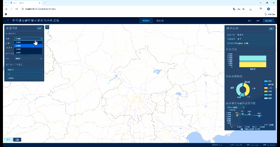

# 中国碳排放可视化与分析系统
本项目构建了一个集数据展示、空间分析和统计分析于一体的WebGIS应用系统，通过现代前端技术实现碳排放数据的可视化表达与交互分析。

## 技术栈

前端

- Vue3
- Vite
- Pinia
- OpenLayers
- ECharts

后端

- Spring Boot 3.3
- Spring Security + JWT（无状态认证）
- JPA + Hibernate

数据库

- PostgreSQL 16 

地图

- GeoServer

## 系统实现
- 用户认证功能（JWT Token）
    - 用户名密码登录（默认账号admin/123456）
    - 登录状态持久化（LocalStorage存储JWT Token）
    - 路由访问控制（未登录拦截非登录页）
    - 退出登录（清除Token并重定向至登录页）
- 地图可视化功能

    - 天地图底图加载（路网、卫星、混合三种模式）
    - 底图切换（支持切换到天地图）
    - 行政区划边界叠加与显隐控制
    - 地图漫游缩放、视图重置
    - 鼠标坐标实时显示
    - 行政区划要素选中高亮/取消高亮
    - 本地GeoJSON数据加载（如成都矢量数据）
    - 多源空间数据集成（天地图WMTS、GeoServer WMS/WFS）
- 数据图表分析功能

    - 碳排放排名图（Top10/BottomN，支持总排放、人均排放等指标切换）
    - GDP-排放相关性散点图（含线性回归趋势线、R²值，支持GDP/人均GDP维度切换）
    - 排放结构分析（行业/范围维度堆叠柱状图）
    - 多年度碳排放趋势分析（折线图+线性回归拟合）
    - 碳排放效率四象限分析（总排放×单位GDP碳排放强度分类）
    - 年份切换（所有图表同步更新）
- 地图-图表双向联动功能

    - 地图选区域→图表更新（对标面板、结构图、趋势图同步）
    - 图表选城市→地图定位高亮
    - 搜索城市→地图定位高亮
    - 清除选中状态→图表/地图恢复默认
- 辅助功能
    - 图层显隐控制（底图、边界图层、GeoJSON图层）
    - ECharts图表响应式适配（窗口大小变化时自动调整）
    - 城市名称归一化匹配（解决跨数据集命名不一致问题）

## 项目结构
vue-ol-map1/
├── vue-ol-map-js/              # Vue 前端
│   └── src/
│       ├── auth/               # 认证（Store + 路由守卫）
│       │   ├── guards/         # 路由守卫（authGuard）
│       │   └── stores/         # 认证状态（authStore）
│       ├── components/         # UI 组件
│       │   ├── charts/         # ECharts 图表组件
│       │   ├── dashboard/      # 仪表盘布局
│       │   ├── map/            # 地图组件（MapView）
│       │   └── panels/         # 控制面板
│       ├── config/             # 静态配置（mapConfig）
│       ├── map/                # 地图核心模块
│       │   ├── composables/    # 地图功能组合函数
│       │   ├── core/           # 地图工厂
│       │   ├── interactions/   # 交互处理
│       │   ├── layers/         # 图层定义
│       │   ├── services/       # WMS/WFS 服务
│       │   └── styles/         # 矢量样式
│       ├── orchestrators/      # 业务编排（map-chart联动）
│       ├── services/           # 数据服务（co2DataService）
│       ├── shared/stores/      # 全局状态（sharedStore）
│       └── utils/              # 工具函数（regression）
│
├── co2-backend/                # Spring Boot 后端
│   └── src/main/java/com/co2emission/
│       ├── Co2Application.java
│       ├── config/             # SecurityConfig
│       ├── controller/         # AuthController, CityEmissionController
│       ├── service/            # AuthService, JwtService, CityEmissionService
│       ├── repository/         # CityEmissionRepository, AppUserRepository, ...
│       ├── entity/             # City, CityEmission, AppUser
│       ├── dto/                # CityEmissionDTO, LoginRequest/Response, ApiResponse
│       ├── security/           # JwtAuthenticationFilter
│       └── exception/          # GlobalExceptionHandler
│
└── database/                   # 数据库脚本
    ├── init.sql                # 建表 DDL（city, city_emission, app_user）
    └── import_dbjson.js        # db.json → PostgreSQL 导入脚本

